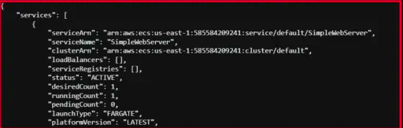
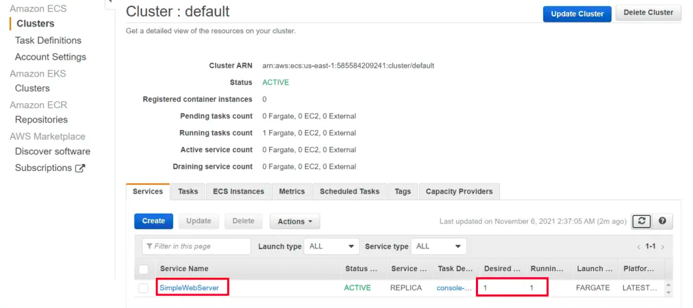
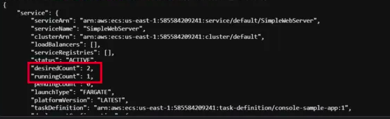
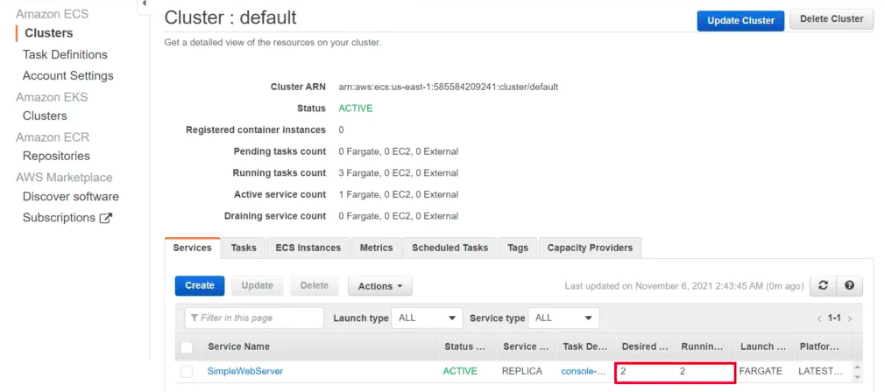

# DESCRIPTION

This template shows how to describe , list and update the service in ECS using the Boto3.

---

#### Prerequisite

* Install Python
* AWS Configure

### Steps

1. Open the folder in your terminal or any supported tool.
2. Run the following commands:

`python3 service-describe-boto3.py`

`python3 service-list-boto3.py`

`python3 service-update-boto3.py`

---

### Outputs

<b>Describe Service

List Service

Update Service</b>

1.

2.

3.

---
